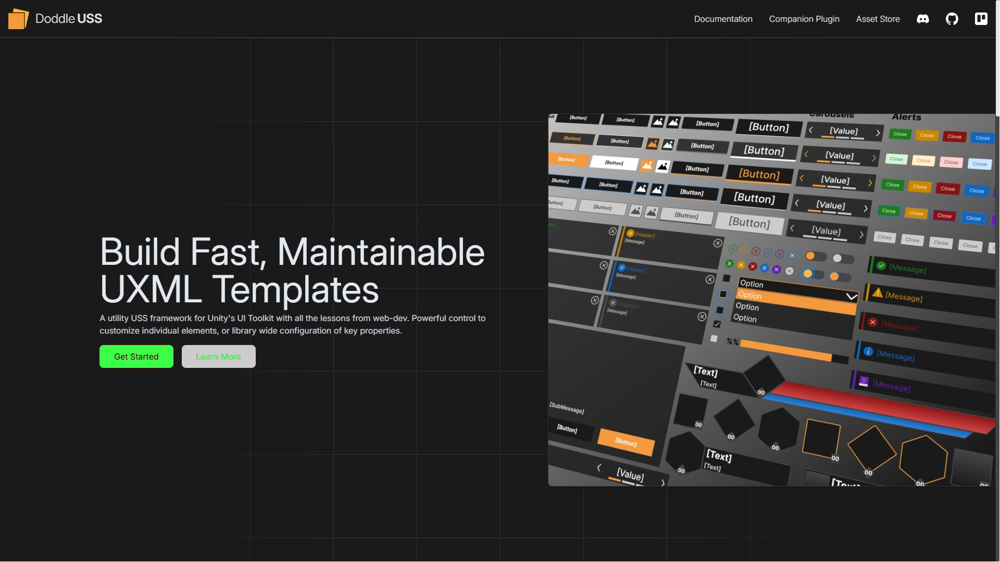

<p align="center">
  <h1>Visual Diff Service</h1>
  Service for comparing two images and producing a diff. Connect to a CI/CD pipeline to compare baseline, and comparison images for an automated visual regression step in PRs as an internal tool to reduce human error when reviewing UI changes. Baseline, and comparison files are converted to byte[] containing RGBA values to produce deltas. Resulting deltas are converted to YIQ colour space to separate luminance from chrominance channels, then a final percieved brightness as humans can percieve changes in brightness better than chrominance. The images are compared pixel by pixel, and any pixel resulting in a delta greater than a threshold is highlighted in red.
</p>

<p align="center">
    
    
    
</p>


## Initial Setup ~60-120 minutes
1. Install [Java 21](https://www.oracle.com/ca-en/java/technologies/downloads/#java21)
    - (JAVA_HOME environment variable must point to jdk folder)
    - **Action:** Verify installation with ```java --version```
    - **Expected Result:** ```openjdk 21.0.7 2025-04-15 LTS```

2. Install [Chocolatey (If on Windows)](https://chocolatey.org/install)
    - **Action:** Verify installation with ```choco --version```
    - **Expected Result:** ```2.4.3```

3. Install [Apache Maven](https://maven.apache.org/install.html)
    - **Action:** Verify installation with ```mvn --version```
    - **Expected Result:** ```Apache Maven 3.9.9```

4. Install [VSCode](https://code.visualstudio.com/download)
5. Install [Azure CLI](https://learn.microsoft.com/en-us/cli/azure/install-azure-cli?view=azure-cli-latest)
    - **Action:** Verify installation with ```az --version```
    - **Expected Result:** ```azure-cli 2.74.0```

6. Install [Azure Tools VSCode Extension Pack](https://marketplace.visualstudio.com/items?itemName=ms-vscode.vscode-node-azure-pack)
7. Install [Postman](https://www.postman.com/downloads/)
8. Create an [Azure Account](https://azure.microsoft.com/en-us/get-started/azure-portal), and have an active subscription
9. Create an [Azure Storage Account](https://learn.microsoft.com/en-us/azure/storage/common/storage-account-create?tabs=azure-portal), and an [Azure Blob Storage Container](https://learn.microsoft.com/en-us/azure/storage/blobs/storage-quickstart-blobs-portal)
10. Clone the repository
11. Set environment variables:
    - Password for basic auth. Default Spring Security generated credentials have been overwritten
        - **Key:** ```APP_SPRING_PASSWORD```
        - **Value:** ```{bcrypt}enterHashedPasswordHere```
    - Username for basic auth
        - **Key:** ```APP_SPRING_USERNAME```
        - **Value:** ```enterUsernameHere```
    - Azure blob storage account name. Connection string is assembled from this info and other 2 azure variables
        - Retrieved from Azure Storage Accounts > [Name in Top Left]**
        - **Key:** ```AZURE_STORAGE_ACCOUNT_NAME```
        - **Value:** ```enterStorageAccountNameHere```
    - Azure blob storage access key. Connection string is assembled from this info and other 2 azure variables
        - Retrieved from **Azure Storage Accounts > Security + Networking > Key**
        - **Key:** ```AZURE_STORAGE_ACCOUNT_KEY```
        - **Value:** ```enterStorageAccessKeyHere```
    - Azure blob storage container name. Do not confuse this with the storage account name. Connection string is assembled from this info and other 2 azure variables
        - Retrieved from **Azure Storage Accounts > Data Storage > Containers > [Name in List of storage containers]**
        - **Key:** ```AZURE_STORAGE_CONTAINER_NAME```
        - **Value:** ```enterStorageContainerNameHere```
12. Run the project locally with ```./mvnw spring-boot:run```
    - Access Swagger UI at ```http//:localhost:8080/swagger-ui/index.html```
    - When sending requests from Postman, select "Basic Auth" in the Auth Type dropdown in the Authorization tab. Supply the **APP_SPRING_PASSWORD**, **APP_SPRING_USERNAME**, but the password must be plain text. Postman will automatically base64 encode the username+password in the request header.
13. The set up is now complete

### Troubleshooting
Build Failure due to Missing Spring Security Credentials
| Category | Info |
| - | - |
| Issue | Error creating bean with name 'securityConfig': Injection of autowired dependencies failed |
| Cause | Missing Spring security credentials |
| Notes | Default credentials for Spring Security are printed out to the console when "./mvnw spring-boot:run" is run. These credentials are only valid during development and will not work when they are overridden in SecurityConfig.java from environment variables |
| Steps to Resolve |
```
1. application.properties must have
app.security.username=${APP_SPRING_USERNAME}
app.security.password=${APP_SPRING_PASSWORD}

2. Environment variables must be set
Key: APP_SPRING_USERNAME
Value: enterUsernameHere
Key: APP_SPRING_PASSWORD
Value: {bcrypt}enterHashedPasswordHere

3. Restart editor
```

Build Failure due to Missing Azure Storage Credentials
| Category | Info |
| - | - |
| Issue | Error processing condition on com.azure.spring.cloud.autoconfigure.implementation.storage.blob.BlobClientConfiguration.blobContainerAsyncClient |
| Cause | Missing Azure Storage credentials |
| Notes | The connection string is built from the storage account name, storage container name, and storage account key. If the values from environment variables cannot be retrieved, BlobServiceClient in BlobService.java fails to build |
| Steps to Resolve | |
```
1. application.properties must have 
spring.cloud.azure.storage.blob.account-name=${AZURE_STORAGE_ACCOUNT_NAME}
spring.cloud.azure.storage.blob.container-name=${AZURE_STORAGE_CONTAINER_NAME}
spring.cloud.azure.storage.blob.account-key=${AZURE_STORAGE_ACCOUNT_KEY}

2. Environment variables must be set
Key: AZURE_STORAGE_ACCOUNT_NAME
Value: enterStorageAccountNameHere
Key: AZURE_STORAGE_ACCOUNT_KEY
Value: enterStorageAccessKeyHere
Key: AZURE_STORAGE_CONTAINER_NAME
Value: enterStorageContainerNameHere

3. Restart editor
```


<br></br>
## Deploying ~20 minutes
1. Ensure the above steps in "Getting Started" are completed and functioning as expected
    - **Disclaimer:** This is intended to be an internal tool. Additional security measures should be configured in Azure for deployment to align with your organization's policy. Currently, this only has Spring's Security basic auth.
2. [Configure the Maven plugin info](https://learn.microsoft.com/en-us/azure/app-service/quickstart-java?tabs=springboot&pivots=java-javase) in the POM.xml file
    - **Action:** Run ```mvn com.microsoft.azure:azure-webapp-maven-plugin:2.14.1:config```
    - **Expected Result:** Step through the options until a config in pom.xml is created
    ```
    <build>
        <plugins>
            <plugin>
                <groupId>com.microsoft.azure</groupId>
                <artifactId>>azure-webapp-maven-plugin</artifactId>
                <version>x.xx.x</version>
                <configuration>
                    <schemaVersion>v2</schemaVersion>
                    <resourceGroup>your-resourcegroup-name</resourceGroup>
                    <appName>your-app-name</appName>
                ...
                </configuration>
            </plugin>
        </plugins>
    </build>
    ```

3. Log in to Azure 
    - **Action:** Run ```az login``` or ```az logn --tenant [tenantID]```
    - **Expected Result:** Verify login by running ```az account show```

4. Build the application
    - **Action:** Run ```mvn clean package```
    - **Expected Result:** 
    ```
    [INFO] ------------------------------------------------------------------------
    [INFO] BUILD SUCCESS
    [INFO] ------------------------------------------------------------------------
    [INFO] Total time:  13.983 s
    [INFO] Finished at: 2025-06-18T12:04:21-04:00
    [INFO] ------------------------------------------------------------------------
    ```

5. Deploy the application to Azure App Services 
    - **Action:** Run ```mvn azure-webapp:deploy```
    - **Expected Result:** 
    ```
    [INFO] Successfully deployed the artifact to <URL>
    [INFO] ------------------------------------------------------------------------
    [INFO] BUILD SUCCESS
    [INFO] ------------------------------------------------------------------------
    [INFO] Total time:  02:20 min
    [INFO] Finished at: 2025-06-18T12:04:21-04:00
    [INFO] ------------------------------------------------------------------------
    ```

6. Set matching environment variables at **Azure App Services > [Name of Service] > Settings > Environemnt Variables**

### Troubleshooting
Build Failure due to unsupported or mismatch of SKU, and size for region
| Category | Info |
| - | - |
| Issue | This region has quota of 0 instances for your subscription. Try selecting different region or SKU |
| Cause | The selected pricing tier that determines app hardware capabilities is not compatible with the requested operation or region |
| Notes | An active Azure subscription is required for this |
| Steps to Resolve | |
```
1. Navigate to  Your Azure Subscription > Settings > Resource Providers. Ensure the following providers are registered
Microsoft.Web
Microsoft.Resources
Microsoft.Storage
Microsoft.Compute

2. Click on the providers > JSON (in the popout window) and ensure the "locations" list supports your set location in pom.xml

3. Try a different service plan or region for deployment. CHange these values in the pom.xml file
<pricingTier></pricingTier>
<region></region>
```


<br></br>
## Monitoring ~2 minutes
1. Check service status
    - **Action:** GET http://localhost:8080/actuator/health in Postman
    - **Action:** GET https://yourAzureAppServicesGeneratedDomain/actuator/health in Postman
    - **Expected Result:** 
    ```
    {
        "status": "UP",
        "groups": [
            "liveness",
            "readiness"
        ],
        "components": {
            "blob": {
                "status": "UP"
            },
            "livenessState": {
                "status": "UP"
            },
            "ping": {
                "status": "UP"
            },
            "readinessState": {
                "status": "UP"
            },
            "ssl": {
                "status": "UP",
                "details": {
                    "validChains": [],
                    "invalidChains": []
                }
            }
        }
    }
    ```

2. Check logs locally at Logs > logs.log. Logging is set up and can be viewed in development locally. Logs are saved to file, and printed to console which are also captured by Azure. Log files have a maximum size of 10MB, and will rotate once they reach that size.
3. Check logs in Azure at Azure App Services > [Name of Service] > Log Stream or enable application file based logs under Azure App Services > [Name of Service] > Monitoring > App Service Logs


<br></br>
## Security ~2 minutes
1. Every endpoint is secured by Spring Security's basic auth that accepts a username, and password except:
/swagger-ui/** and other related swagger UI paths to view API docs
/v3/api-docs/** for JSON representation
/actuator/health for health and blob connectivity status

### Troubleshooting
401 returned for endpoints
| Category | Info |
| - | - |
| Issue | 401 Unauthorized |
| Cause | Username and/or password supplied in request header is missing and/or incorrect |
| Notes | The incoming header should supply the username and password in plain text, and not encoded like how the environment variable is stored. Postman will automatically encode them |
| Steps to Resolve |
```
1. Ensure environment variables are set up correctly as stated in the "Getting Started" section. The APP_SPRING_PASSWORD must include the prefix "{bcrypt}" followed by your encoded password
Key: APP_SPRING_USERNAME
Value: enterUsernameHere
Key: APP_SPRING_PASSWORD
Value: {bcrypt}enterHashedPasswordHere

2. Ensure the Authorization tab has auth type set to "Basic Auth" or "Inherited by Parent" with the parent set up correctly in Postman

3. Restart VSCode for it to recognize newly set environment variables
```

403 returned for endpoints
| Category | Info |
| - | - |
| Issue | 403 Forbidden |
| Cause | Username and password supplied in header authenticated teh user, but you have insufficient permissions. |
| Notes | The incoming header should supply the username and password in plain text, and not encoded like how the environment variable is stored. Postman will automatically encode them |
| Steps to Resolve |
```
1. Ensure environment variables are set up correctly as stated in the "Getting Started" section. The APP_SPRING_PASSWORD must include the prefix "{bcrypt}" followed by your encoded password
Key: APP_SPRING_USERNAME
Value: enterUsernameHere
Key: APP_SPRING_PASSWORD
Value: {bcrypt}enterHashedPasswordHere

2. Ensure the Authorization tab has auth type set to "Basic Auth" or "Inherited by Parent" with the parent set up correctly in Postman

3. Restart VSCode for it to recognize newly set environment variables
```


<br></br>
## Common Errors
Generic 400 returned for endpoints when using Postman
| Category | Info |
| - | - |
| Issue | 400 Bad Request |
| Cause | File reference not updated |
| Notes | Any request that includes a file, remove the file, and select it again. If the file was moved, or edited in any way, Postman will still show it selected, but the request will fail as the file was not sent. The reference will not be updated |
```
1. Remove the file's reference

2. Enter it again
```


<br></br>
## Sample Output
| Baseline | Comparison | Diff |
| - | - | - |
|  |  |  |
|  |  |  |


<br></br>
## Service Architecture Overview & Diagrams
1. Access swagger UI at
    - Local: http://localhost:8080/swagger-ui/index.html
    - Deployed: https://yourAzureAppServicesGeneratedDomain/swagger-ui/index.html

### Sequence Diagram for POST /compare


### Sequence Diagram for POST /compare-direct


### Sequence Diagram for POST /files/upload


### Sequence Diagram for GET /files/metadata/{filesName}


### Sequence Diagram for GET /files/metadata


### Sequence Diagram for GET /files/{fileName}


### Sequence Diagram for DELETE /files/{fileName}


### Class Diagrams


